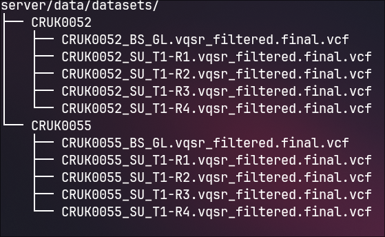

# Phylogenetic Analysis Pipeline

A Docker-based pipeline for phylogenetic analysis of VCF files. It runs multiple bioinformatics tools (VCF Merger, IQ-TREE, FastReer, MrBayes) in parallel, compares the resulting trees, and presents everything through a web UI.

## Architecture

```
Client → FastAPI → Orchestrator Container
                       ↓
           Local Registry → Tool Containers → Results
```

The **orchestrator** is a short-lived container spawned per job. It pulls tool images from a local Docker registry, runs the pipeline stages, and writes results to a shared volume. The **FastAPI** backend manages jobs and exposes results; the **web** frontend polls it for status and displays results.

- **server/** — FastAPI backend: job management, dataset discovery, result serving
- **orchestrator/** — pipeline runner: merger → inference tools → comparison
- **web/** — Python Shiny frontend: job submission, status polling, result visualization

## Prerequisites

- Docker Engine 20.10+
- Docker Compose v2.0+ (the `docker compose` plugin, not the standalone `docker-compose`)
- 20 GB free disk space (Docker images + build cache take ~12 GB)
- 2 GB RAM minimum (4 GB recommended — IQ-TREE, FastReer, and MrBayes run in parallel)

## Installation & Setup

**1. Clone the repository**

```bash
git clone <repo-url>
cd <repo-name>
```

**2. (Optional) Configure ports**

All host-side ports can be overridden via a `.env` file in the project root:

| Variable        | Default | Service            |
| --------------- | ------- | ------------------ |
| `FRONTEND_PORT` | `8080`  | Web frontend       |
| `FASTAPI_PORT`  | `8000`  | FastAPI backend    |
| `REGISTRY_PORT` | `5000`  | Docker registry    |
| `GRAFANA_PORT`  | `3000`  | Grafana (optional) |

Example — override ports that conflict on your machine:

```bash
echo "REGISTRY_PORT=5001" >> .env
echo "FRONTEND_PORT=9080" >> .env
```

**3. Add datasets**

See the [Datasets](#datasets) section for the required structure. The data directories are created automatically on first startup.

**4. Run the startup script**

This builds all tool images, pushes them to the local registry, and starts all services:

```bash
./scripts/startup.sh
```

To also start the optional Grafana log dashboard, pass `--grafana`:

```bash
./scripts/startup.sh --grafana
```

Once startup completes, the following services are available:

| Service        | Default URL                |
| -------------- | -------------------------- |
| Frontend       | http://localhost:8080      |
| FastAPI        | http://localhost:8000      |
| API docs       | http://localhost:8000/docs |
| Grafana (opt.) | http://localhost:3000      |

If you overrode any ports in `.env`, replace the default port accordingly.

## Datasets

Datasets are read from the `server/data/datasets/` directory. Each subfolder is one dataset. The pipeline requires **at least 3 VCF files** per dataset — one per sample — to produce meaningful phylogenetic trees. Both `.vcf` and `.vcf.gz` files are accepted.

**Adding a dataset — via the frontend (recommended):**

Use the upload form on the **Datasets** page to create a new dataset and upload `.vcf` files directly from your browser.

**Adding a dataset — manually:**

1. Create a folder named after your dataset inside `server/data/datasets/`:
   ```
   server/data/datasets/<dataset_name>/
   ```
2. Place **at least 3** `.vcf` or `.vcf.gz` files inside it (one per sample):
   ```
   server/data/datasets/my_cohort/sample1.vcf
   server/data/datasets/my_cohort/sample2.vcf.gz
   server/data/datasets/my_cohort/sample3.vcf
   ```
3. The dataset appears in the frontend and API automatically — no restart needed.

Example directory structure:



> Folders with fewer than 3 VCF files are shown in the frontend with a warning and cannot be submitted for analysis. Folders with no VCF files are ignored entirely. Both `.vcf` and `.vcf.gz` files count toward the minimum.

## Usage

1. Open the frontend at `http://localhost:8080` (or your `FRONTEND_PORT`).
2. On the **Analysis** page, select a dataset and click **Start Analysis**.
3. You are redirected to the job detail page, which shows live pipeline status and logs.
4. Once the job completes, results are displayed on the same page — per-tool phylogenetic trees and a side-by-side comparison of topology and branch length similarity.
5. Use the **Export HTML** or **Export PDF** buttons to download a full report.

Results are also written to `server/data/results/<job_id>/` on disk.

## Grafana Log Dashboard

Grafana is an optional service that provides a browser-based UI for browsing logs from all pipeline components (FastAPI, orchestrator, and each tool).

Start it with `./scripts/startup.sh --grafana`, then open `http://localhost:3000` (or your `GRAFANA_PORT`). The **Phylogenetic Pipeline Logs** dashboard opens automatically. Use the **Service** dropdown to filter by component, or paste a **Job ID** to see logs for a specific run.

Logs are stored in Loki and persist until the volume is cleared (e.g. via `./scripts/clear-jobs.sh` or `./scripts/reset.sh`).

## Management

| Task                                   | Command                          |
| -------------------------------------- | -------------------------------- |
| Start all services                     | `./scripts/startup.sh`           |
| Start with Grafana                     | `./scripts/startup.sh --grafana` |
| Stop all services                      | `docker compose down`            |
| Restart                                | `./scripts/startup.sh`           |
| Full reset (wipe all data and volumes) | `./scripts/reset.sh`             |
| View live service logs                 | `docker compose logs -f fastapi` |
